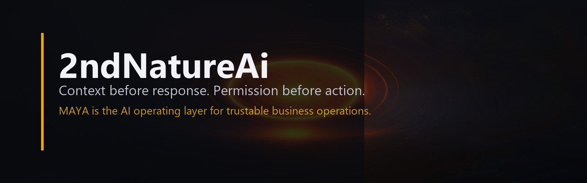

  

<h1 align="center">MAYA</h1>

<strong>MAYA knows your business well enough to speak for it, and smart enough to know when to hand you the phone.</strong>

Local-first, permissioned AI products built by <a href="https://github.com/2ndNatureAI">2ndNatureAi</a>.

---

## What we are building

MAYA is a trustable AI operations layer designed to help teams respond, route, organize, and follow up using their actual business context while keeping human control visible.

Our standard is straightforward:

- **Context before response** so AI receives the information that matters for the current task.
- **Permission before action** so tools operate within explicit, reviewable boundaries.
- **Evidence after execution** so important results can be inspected instead of merely trusted.
- **Human handoff when judgment matters** because useful automation should know where its authority ends.

## Public beta products

### [ReadTheRoom](https://github.com/MAYA-Platform/ReadTheRoom)

A local, reviewable behavior-calibration layer that helps AI match a user's tone, correction style, task mode, and tool-restraint preferences before responding.

[View source](https://github.com/MAYA-Platform/ReadTheRoom) · [Latest prerelease](https://github.com/MAYA-Platform/ReadTheRoom/releases/latest)

### [MAYA Repo Brief](https://github.com/MAYA-Platform/MAYA-Repo-Brief)

A local static repository ZIP analyzer that turns source structure, safety signals, and implementation evidence into a readable decision brief without executing the repository.

[View source](https://github.com/MAYA-Platform/MAYA-Repo-Brief) · [Latest prerelease](https://github.com/MAYA-Platform/MAYA-Repo-Brief/releases/latest)

## 📢 Recent

**July 2026**, ReadTheRoom and MAYA Repo Brief are available as public beta releases. The core context-engine and permission architecture continues under active development. New public releases appear here when independently testable.

## Current stage

These repositories are focused public beta products in the broader MAYA ecosystem. The platform's private operating architecture remains under active development and controlled review.

Public releases are bounded, versioned, and independently testable. They are not claims that the full MAYA platform is generally available or operating as a hosted production service.

---

<strong>2ndNatureAi</strong> Context before response. Permission before action.

